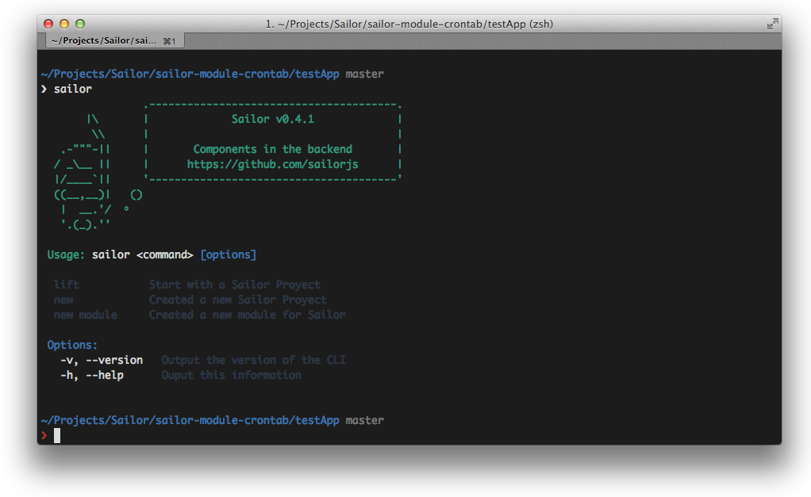
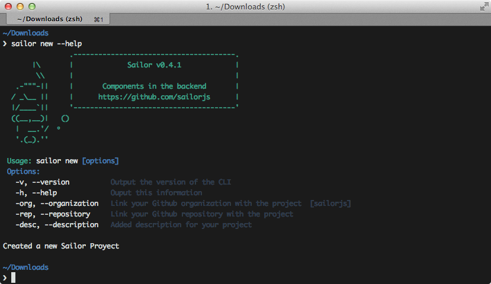
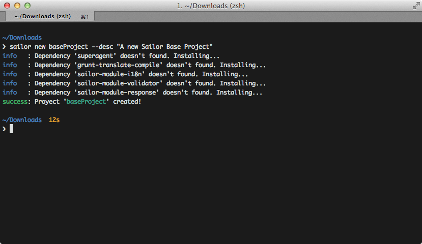
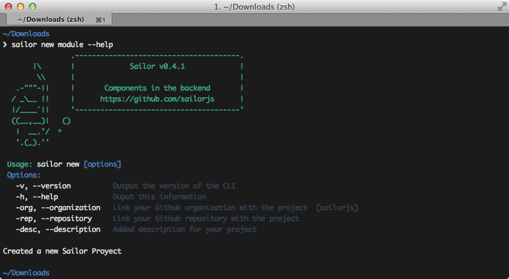
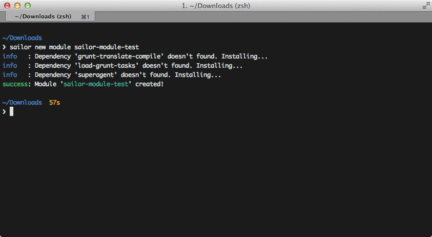
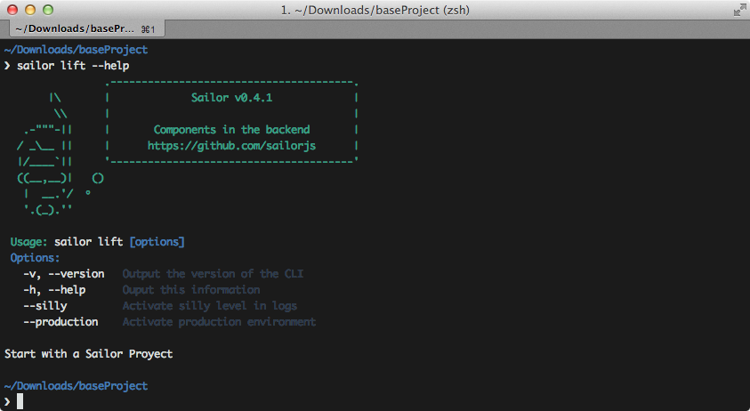
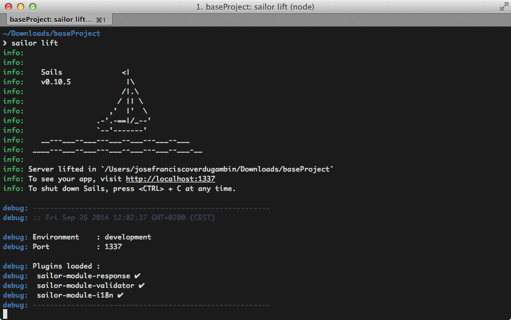

# CLI (Command Line Interface)

## Propósito

Es la línea de comandos de Sailor que interactúa directamente con el usuario. A través del CLI podrás:

* Crear la estructura base para tus proyectos.
* Crear la estructur apara desarrollar un nuevo módulo.
* Arrancar el servidor, tanto para entornos de pruebas como para producción.

## Instalación

### Prerequisitos

Antes de instalar **SailorJS** en tu sistema deberás contar con la última versión estable de NodeJS y NPM (Sistema de paquetes para NodeJS).

Si tienes dudas sobre este proceso te recomendamos que visites su [página web oficial](http://nodejs.org/download/).

### Instalando SailorJS

Simplemente utiliza el gestor de paquetes NPM para obtener la última versión de **SailoJS**. Abre un nuevo terminal y escribe:

```bash
npm install sailorjs -g
```

Lo cual instalará **SailorJS** de manera global en tu sistema.

## Comandos Principales

Una vez que tengas instalado **SailorJS** podrás interactuar con su CLI (*Client Line Interface*) mediante el cual podrás realizar tareas como:

* Crear el scaffolding para un nuevo proyecto base.
* Ejecutar tu proyecto base.
* Crear el scaffolding para desarrollar un nuevo módulo.

Ejecuta el comando `sailor` en el terminal para invocar al CLI:



Si tienes duda sobre algún comando utiliza el parámetro `--help`.

## Comandos Principales

### Nuevo Proyecto Base



Éste comando generará el scaffolding necesario para que puedas desarrollar un nuevo proyecto.

El comando admite algunos parámetros para que automáticamente enlace con tu cuenta de Github y genere los ficheros `package.json` y `README.md` asociados a la información proporcionada, como **descripción**, **organización** y **repositorio**.



Si has desarrollado antes para **Sails** nota como el scaffolding generado es similar pero extendido:

```
.
├── Gruntfile.js
├── LICENSE.md
├── README.md
├── api
├── app.js
├── app.json
├── assets
├── config
├── node_modules
├── package.json
├── tasks
├── test
├── translation
└── views
```

### Nuevo Módulo



El comando para generar un nuevo módulo es muy similar al de un proyecto base. Únicamente difiere en el scaffolding generado.



De nuevo nota que es posible proporcionar algunos parámetros para cumplimentar información relativa a los ficheros `package.json` y `README.md`.

Si atendemos al scaffolding, veremos que las diferencias son mínimas.

```
.
├── Gruntfile.coffee
├── LICENSE.md
├── README.md
├── api
├── config
├── node_modules
├── package.json
├── tasks
├── test
└── translation
```
### Ejecutar tu servidor



El comando ´lift´ es heredado del CLI de Sails y sirve para poder correr nuestro servidor.

Al hacerlo, cargará los módulos asociados al proyecto base. Más adelante explicaremos cómo hacer eso, pero por ahora tenemos que saber que tanto si vamos a desarrollar en local como en producción deberemos utilizarlo.



Se proporcionan comandos útiles:

* `--silly` imprime por pantalla todo el debug del sistema de bootstrapping y es útil a la hora de desarrollar.
* `--production` prepara el entorno para ejecutarse en un sistema de producción final.
