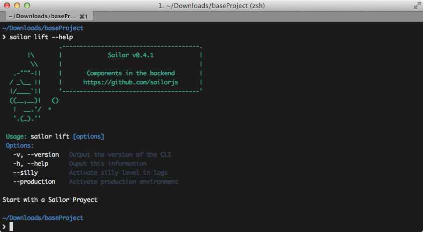

# CLI (Command Line Interface)

## Comandos Principales

### Ejecutar tu servidor

El comando `lift` es heredado del CLI de Sails y sirve para poder correr nuestro servidor:

Al hacerlo, cargará los módulos asociados al proyecto base. Más adelante explicaremos cómo hacer eso, pero por ahora tenemos que saber que tanto si vamos a desarrollar en local como en producción deberemos utilizarlo:

Se proporcionan comandos útiles:

* `--silly` imprime por pantalla todo el debug del sistema de bootstrapping y es útil a la hora de desarrollar.
* `--production` prepara el entorno para ejecutarse en un sistema de producción final.
