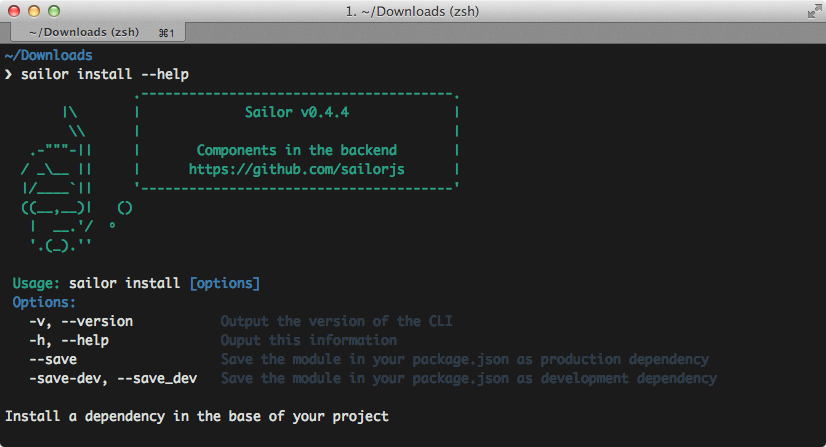

# CLI (Command Line Interface)

## Comandos Principales

### Instalar un módulo

Con el comando  `install` podrás instalar rápidamente un módulo en un proyecto base:

El funcionamiento es el mismo que el comando `npm`, es decir, deberás proporcionar un paquete registrado en `npm` para que pueda ser instalado.

Al instalar un módulo de esta manera será automáticamente enlazado en tu proyecto base en el fichero `config/modules`.

En cuanto a parámetros, podremos utilizar:

* `--save`: Guarda la dependencia en el `package.json` de tu proyecto como una dependencia de producción.
* `--save-dev`: Guarda la dependencia en el `package.json` de tu proyecto como una dependencia de desarrollo.
