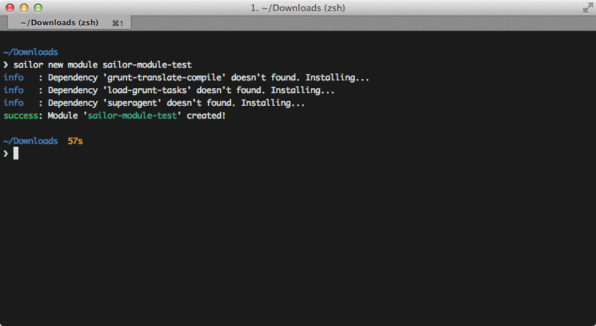

# CLI (Command Line Interface)

## Comandos Principales

### Nuevo Módulo

El comando para generar un nuevo módulo es muy similar al de un proyecto base. Únicamente difiere en el scaffolding generado.


Si atendemos al scaffolding, veremos que la diferencia es mínima:

```bash
.
├── Gruntfile.coffee
├── LICENSE.md
├── README.md
├── api
├── config
├── node_modules
├── package.json
├── tasks
├── test
└── translation
```

De nuevo nota que es posible proporcionar algunos parámetros para cumplimentar información relativa a los ficheros `package.json` y `README.md`:


