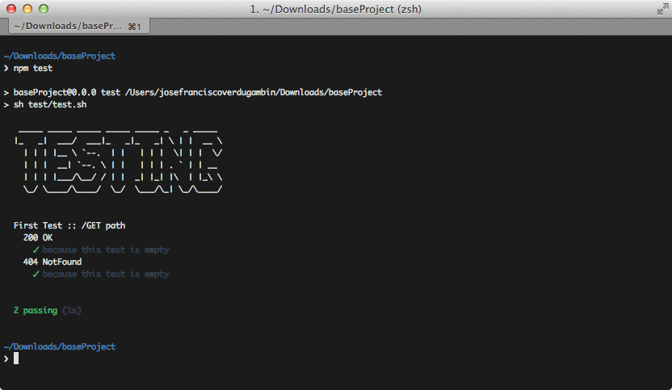

## Testing, testing everywhere

Como hemos dicho anteriormente, desde el momento que generas tu proyecto base o módulo podrás empezar a testear tu código.

En ambos casos para lanzar los tests tendrás que ejecutar el comando `npm test`:

Por defecto se incluyen algunos test a modo de ejemplo. Te aconsejamos [ver tests de los módulos oficiales](https://github.com/sailorjs/sailor-module-user/tree/master/test) para que sepas cómo dividir y testear tu código de manera correcta.
